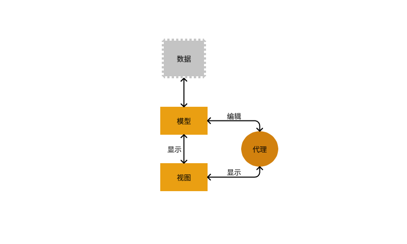
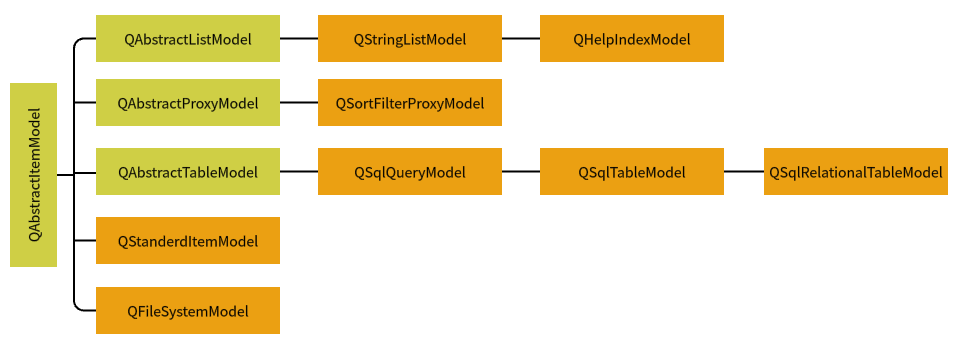
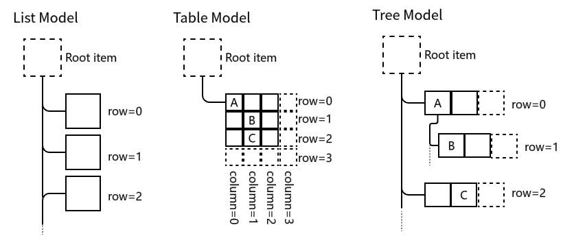
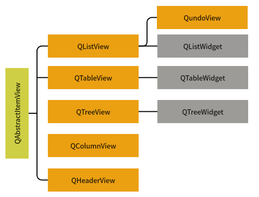

# QT:模型/视图结构

## 基本概述
* `数据（data）`：如数据库的一个数据表或SQL查询结果，内存中的一个字符串，或磁盘文件结构等。
* `模型（model）`：与数据通信，并为视图组件提供数据接口。
* `视图（view）`：是屏幕上的界面组件，视图从数据模型获得每个数据项的模型索引（model index），通过模型索引获取数据。
* `代理（delegate）`：在视图与模型之间交互操作时提供的临时编辑器。编辑项视图提供数据是单向的，一般仅用于显示。当需要在视图上编辑数据时，代理会为需要编辑的数据提供一个编辑器。<br>
   <br>
&emsp;&emsp;**注意：** 模型、视图和代理之间使用信号与槽通信<br>
&emsp;&emsp; * 所有的基于项（item）的模型类都基于`QAbstractItemModel`<br>
&emsp;&emsp; * 模型只在内存临时存储数据，模型的数据来源可以是其他类、文件、数据库。<br>

#### QAbstractItemModel类的继承关系图
   <br>
`数据模型`中存储数据的基本单元都是项（Item），每个项有一个行号、一个列号、还有一个父项 <br>
   <br>
`QModelIndex`表示模型索引的类。模型索引提供数据存取的一个临时指针。
```c++
// table model
QModelIndex indexA = model->index(0,0,QModelIndex());
QModelIndex indexC = model->index(2,1,QModelIndex());
// tree model
QModelIndex indexB = model->index(1,0,indexA);
```
`项的角色`：在为数据模型的一个项设置数据时，可以赋予其不同项的角色的数据。
> 模型中的每个项都有一组与其关联的数据元素，每个元素都有自己的角色。视图使用这些角色向模型指示它需要哪种类型的数据。
```c++
void QStandardItem::setData(const QVariant &value,int role=Qt::UserRole+1);

QVariant QStandardItem::data(int role = Qt::UserRole+1)const;
```

#### QAbstractItemView类的继承关系图
   <br>
&emsp;&emsp;**视图组件**：显示数据时，只需要调用视图类的setModel()函数；视图组件不存储数据。 <br>
&emsp;&emsp;`便利类`为组件的每个节点或单元格创建一个项（Item），用项存储数据、格式设置等；`便利类`没有数据模型，将界面与数据绑定了；`便利类`缺乏对大型数据源进行灵活处理的能力，适用于小型数据的显示和编辑。<br> <br>

___代理___ <br>
* 代理就是在视图组件上为编辑数据提供编辑器
> 如在表格组件中编辑一个单元格的数据时，缺省是使用一个`QLineEdit`编辑器框。代理负责从数据模型获取相应的数据，然后显示在编辑器里，修改数据后，又将其存到数据模型中
* QAbstractItemDelegate是所有代理类的基类。<br>
> **自定义代理**<br>
> 您可以设计几个自定义代理类,在编辑单元格的数据时，默认的代理编辑器是**QLineEdit**编辑框，若自定义代理类，可使用QSpinBox、QDoubleSpinBox、QComboBox等作为代理编辑器<br>
> QAbstractItemDelegate是所有代理类的抽象基类，QStyledItemDelegate是视图组件使用的缺省的代理类，QItemDelegate也是类似功能的类。区别在于，QStyledItemDelegate可以使用当前> 的样式表来设置绘制组件，因此建议使用QStyledItemDelegate <br><br>
> 定义的类必须重写实现的几个函数：<br>
> * createEditor():创建用于编辑模型数据的widget组件，如QSpinBox、QComboBox
> * setEditorData():从数据模型获取数据，供widget组件进行编辑
> * setModelData():将Widget组件上的数据更新到数据模型上
> * updataEditorGeometry():用于给Widget组件设置一个合适的大小
