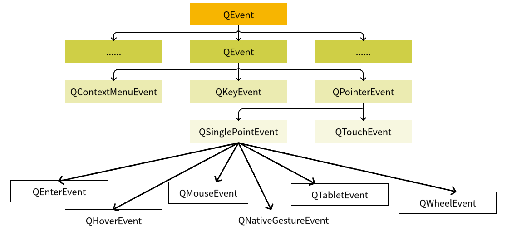

# QT的事件系统

GUI应用程序是由事件（event）驱动的，点击鼠标，按下按键，窗口大小改变等

## Qt事件

按事件的来源，可将事件分为3类： 

- `自生事件（spontaneous event）`：由窗口系统产生，如：QKeyEvent、QMouseEvent；自生事件会进入系统队列，等待事件循环的处理。
- `发布事件（posted event）`：是由Qt应用程序产生，如：QTimerEvent；使用QCoreApplication::postEvent()产生发布事件，等待事件循环的处理。
- `发送事件（send event）`：有Qt或其他程序定向发送的事件；使用QCoreApplication::sendEvent()产生发送事件，有对象的event()函数直接处理。

> Qt的主事件循环(QCoreApplication::exec())从事件队列中获取原生的系统事件，将它们转换为QEvent，并将转换后的事件发送给QObject；任何QObject派生的类都可以处理事件。

QWidget类重新实现了函数event()，并针对一些典型的事件定义了专门的事件处理函数。要对一些典型事件进行处理，只需重新实现这些事件处理函数即可。

## Qt事件与信号

- 界面组件类的很多信号可以看作是对某些事件的封装，例如QPushButton的clicked()信号，可以看作是对QEvent::MouseButtonRelease类型事件的封装
- 但是Qt的界面组件只是将少数事件封装成了信号。例如，QLabel就没有与鼠标双击事件对应的信号。可以从QLabel派生一个类，把鼠标双击事件转换为发射一个自定义信号doubleClicked()，即，将mouseDoubleClickEvent封装为doubleClicked()信号

